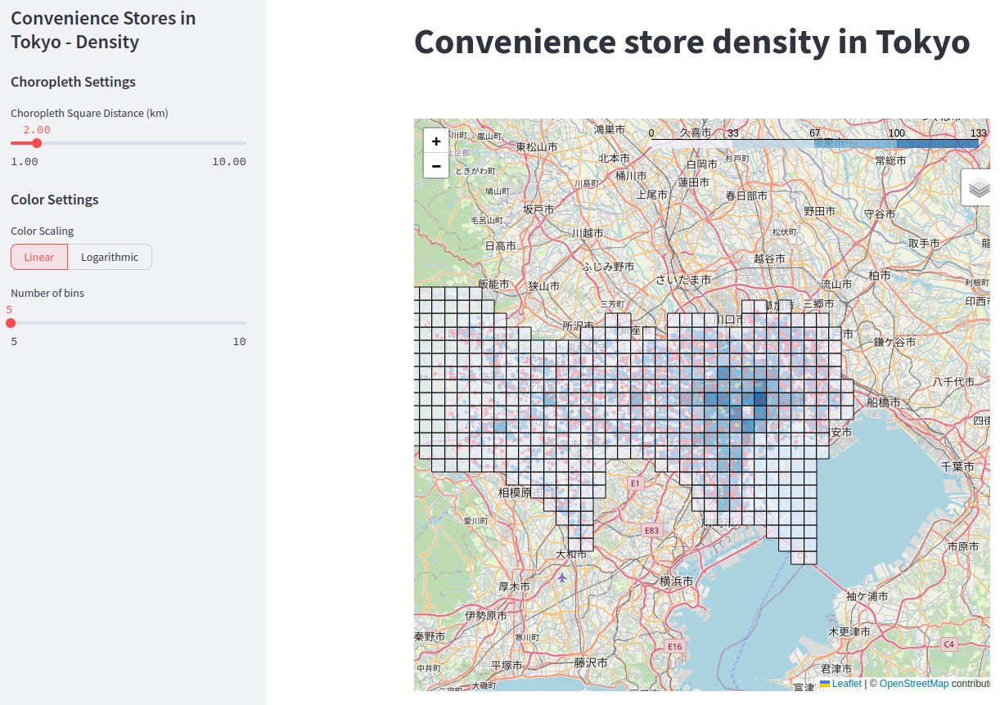

# Convenience Store Density in Tokyo - Visualization

Mapping visualization of convenience store density in Tokyo. Accessible from https://jdingo-tokyo-konbini-choropleth.streamlit.app/.



## Running locally

- Install requirements

```bash
pip install -r requirements.txt
```

- Run Streamlit application

```bash
streamlit run streamlit_app.py
```

## Credits

Data © [OpenStreetMap](https://www.openstreetmap.org/copyright/en) contributors, [ODbL](https://opendatacommons.org/licenses/odbl/) ([Terms](https://opendatacommons.org/licenses/odbl/1-0/)) <br>
Data mining by [Overpass API ](https://overpass-api.de/)and [Overpass Turbo](https://overpass-turbo.eu/)<br>
Map tiles © [OpenStreetMap](https://www.openstreetmap.org/copyright/en) contributors
